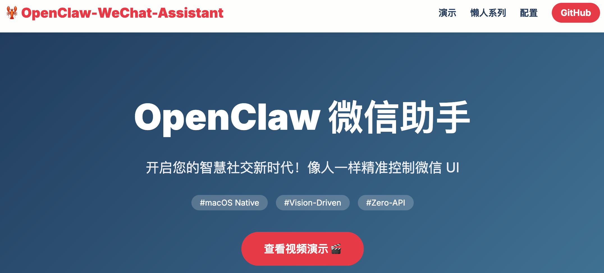
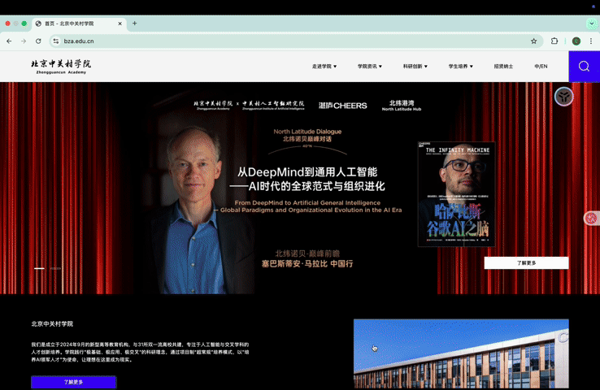
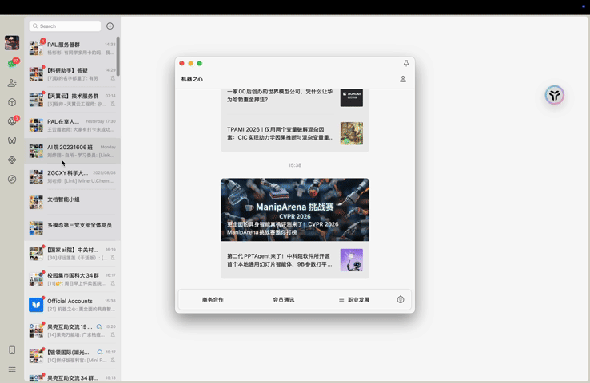
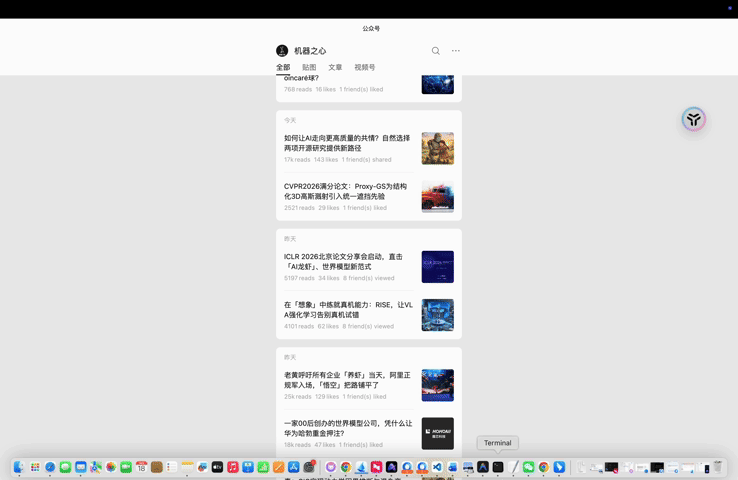

# 🦞 OpenClaw-Desktop-Skillset

> **OpenClaw Desktop Skillset: Your 24/7 Digital Twin for AI Professionals.**

[](VERSION)
[](https://github.com/OpenClaw/openclaw)
[](#-configuration)
[](https://dengc2023.github.io/OpenClaw-Desktop-Skillset/docs/index.html)

[中文版 (Chinese)](README.md) | **English**

---

## 🌐 Live Showcase

> **"Experience the precision of OpenClaw-Desktop-Skillset in our interactive showcase."**

We have built a dedicated showcase website for this project, featuring full-skill demo videos and interactive introductions:
👉 **[Click to Access Live Showcase](https://dengc2023.github.io/OpenClaw-Desktop-Skillset/docs/index.html)**



---

## 🧐 Why This Project? (The "Why")

As AI professionals, we face **massive information overload** and **fragmented tasks** every day:
- **Information Overload**: WeChat Official Accounts (OAs) are our core channel for industry trends, paper reviews, and technical insights. However, manually clicking, reading, and organizing is time-consuming and often leads to missing critical updates.
- **Cross-Device Fragmentation**: We often encounter "phone is not around" or "away from my desk, but need to send a large file/image from my PC to a friend."

### 🔑 Breaking the "API Barrier"

Traditional automation relies on official APIs. However, for highly closed desktop applications like WeChat, **no official APIs are provided for reading, searching, or social interaction**. This renders traditional scrapers or integration tools completely useless.

**OpenClaw-Desktop-Skillset** takes the hardest but most thorough path:
- **Vision-Driven**: Like a human operator, it drives the UI through "Seeing" (OCR/Template Matching) and "Acting" (Simulated Clicks/Keystrokes).
- **Zero API Dependency**: As long as there is a UI on the screen, OpenClaw can operate it, regardless of API availability.
- **Real Environment Simulation**: This approach is the closest to actual user behavior, bypassing interface limitations and achieving true full-desktop automation.

---

## 🚀 Core Skillset (Lazy Series)

### 1. Lazy Essential: WeChat OA Reader
- **Goal**: Solve the "want to read but no time, collecting means reading" pain point.
- **Capabilities**: Auto-search OAs -> Enter history messages -> Dynamic OCR title matching -> Simulated scroll reading -> Structured knowledge summarization.

#### 🧩 Long-Chain Reasoning Visual Workflow

| Step 1: Search & Home | | Step 2: Browse History | | Step 3: Read Article |
| :---: | :---: | :---: | :---: | :---: |
|  | <font size="10">➔</font> |  | <font size="10">➔</font> |  |
| *Search OA and activate main window* | | *Dynamic OCR matching message list* | | *Human-like scrolling and reading* |

- **Significance of Long-Chain Reasoning**: 
    - This is the most technically profound skill in this project. It requires the agent to maintain task context across multiple UI layers (search page, profile page, message list, article view) in a complex desktop environment.
    - The agent must make real-time decisions based on visual feedback from each frame (e.g., confirming search results, detecting list loading, identifying the end of an article), showcasing OpenClaw's superior capability in handling high-complexity, multi-step task workflows.
- **Value**: Let OpenClaw be your 24/7 digital reading secretary. Just read the summary when you want, and free your hands completely.

### 2. Lazy Social: Social & Collaboration (Developing...)
- **Auto Moments**: Automatically fetch and share frontier news to keep your technical sensitivity.
- **Lazy File Transfer**: Remotely drive OpenClaw to send files or images from your PC, solving the "out of office, file at home" gap.

---

## 🎬 Demo Showcase

> **"Experience Automation with Human-like Precision."**

- [WeChat OA Reader Demo](examples/demos/wechat-oa-reader-demo.mp4) (Showcases full-screen search, precise title locating, and automated scrolling)

---

## 🛠️ Configuration

> [!IMPORTANT]
> **Current version primarily supports macOS (Intel/Apple Silicon)**.

### 1. Basic Drivers (macOS Native)
- **UI Interaction**: [cliclick](https://github.com/BlueM/cliclick) (for macOS coordinate simulation).
  ```bash
  brew install cliclick
  ```
- **System Interaction**: AppleScript (for keystrokes and clipboard, built-in).
- **Window Management**: Uses Python `Quartz` framework for precise window positioning.

### 2. Python Environment
- **Conda Environment**: Recommended to use `base` or a dedicated OpenClaw env.
- **Dependencies**: See `requirements.txt`.

### 3. Screen & Scaling (Retina Calibration)
- **Core Logic**: For macOS Retina displays (2x scaling), screenshot coordinates must be **divided by 2 (/2)** before being passed to `cliclick`. Built-in scripts handle this automatically.
- **UI Setup**: Full-screen mode for WeChat is recommended for stable visual anchors.

---

## 🌟 Vision

- **24/7 Productivity**: The agent reads and organizes while you rest.
- **Instruction-Driven**: Simplify complex UI operations into a single command: "Read the latest 3 articles from XXX."
- **Full-Desktop Coverage**: Starting from WeChat, ultimately reaching every app on your desktop.

---

## 🤝 Contribution & Competition Support

If you also suffer from information overload, join us to build more practical desktop skills for OpenClaw.

**"Let OpenClaw handle the reading, while you focus on the leading."**
